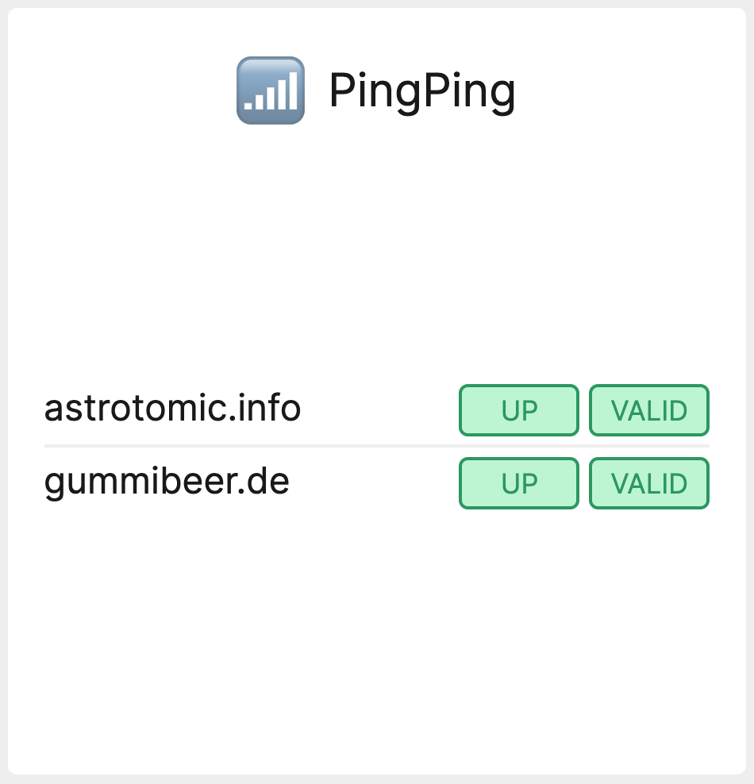

# A tile to display the status of PingPing Monitors



[](https://packagist.org/packages/astrotomic/laravel-dashboard-pingping-tile)
[](https://github.com/Astrotomic/laravel-dashboard-pingping-tile/blob/master/LICENSE)
[](https://plant.treeware.earth/Astrotomic/laravel-dashboard-pingping-tile)

[](https://github.com/Astrotomic/laravel-dashboard-pingping-tile/actions?query=workflow%3Arun-tests)
[](https://styleci.io/repos/262285327)

[](https://packagist.org/packages/astrotomic/laravel-dashboard-pingping-tile) 
[](https://opencollective.com/astrotomic)

This tile can be used on the [Laravel Dashboard](https://docs.spatie.be/laravel-dashboard) to display the status of [PingPing](https://pingping.io/) Monitors.

## Installation

You can install the package via composer:

```bash
composer require astrotomic/laravel-dashboard-pingping-tile
```

In the `dashboard` config file, you must add this configuration in the `tiles` key. The `stations` should contain the IDs of the PingPing stations that you want to display on the dashboard.

```php
// in config/dashboard.php

return [
    // ...
    'tiles' => [
        'pingping' => [
            'api_key' => '', // https://pingping.io/account/api
            'monitors' => [
                // IDs can be found in URL https://pingping.io/monitors/[0-9]+
            ],
            'refresh_interval_in_seconds' => 60,
        ],
    ],
];
```

In `app\Console\Kernel.php` you should schedule the `\Astrotomic\PingPingTile\FetchPingPingMonitorsCommand` to run. You can let it run every minute if you want. You could also run it less frequently if fast updates on the dashboard aren't that important for this tile.

```php
// in app/console/Kernel.php

protected function schedule(Schedule $schedule)
{
    // ...
    $schedule->command(\Astrotomic\PingPingTile\FetchPingPingMonitorsCommand::class)->everyMinute();
}
```

## Usage

In your dashboard view you use the `livewire:pingping-tile` component. 

```html
<x-dashboard>
    <livewire:pingping-tile position="a1" />
</x-dashboard>
```

### Customizing the view

If you want to customize the view used to render this tile, run this command:

```bash
php artisan vendor:publish --provider="Astrotomic\PingPingTile\PingPingTileServiceProvider" --tag="dashboard-pingping-tile-views"
```

## Testing

``` bash
composer test
```

## Changelog

Please see [CHANGELOG](CHANGELOG.md) for more information on what has changed recently.

## Contributing

Please see [CONTRIBUTING](CONTRIBUTING.md) for details.

## Security

If you discover any security related issues, please email gummibeer@astrotomic.info instead of using the issue tracker.

## Credits

- [Tom Witkowski](https://github.com/Gummibeer)
- [All Contributors](https://github.com/Astrotomic/laravel-dashboard-pingping-tile/graphs/contributors)

## License

The MIT License (MIT). Please see [License](LICENSE) file for more information.## Treeware

You're free to use this package, but if it makes it to your production environment I would highly appreciate you buying the world a tree.

It’s now common knowledge that one of the best tools to tackle the climate crisis and keep our temperatures from rising above 1.5C is to [plant trees](https://www.bbc.co.uk/news/science-environment-48870920). If you contribute to my forest you’ll be creating employment for local families and restoring wildlife habitats.

You can buy trees at [offset.earth/treeware](https://plant.treeware.earth/Astrotomic/laravel-dashboard-pingping-tile)

Read more about Treeware at [treeware.earth](https://treeware.earth)
